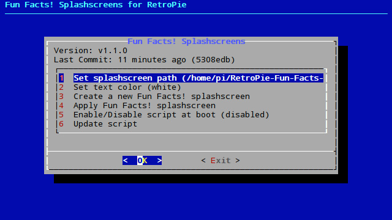
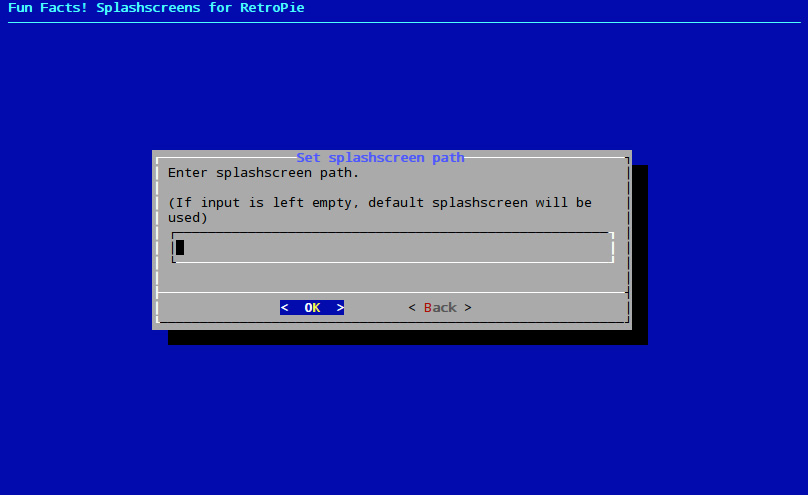
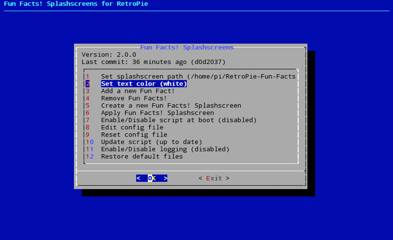
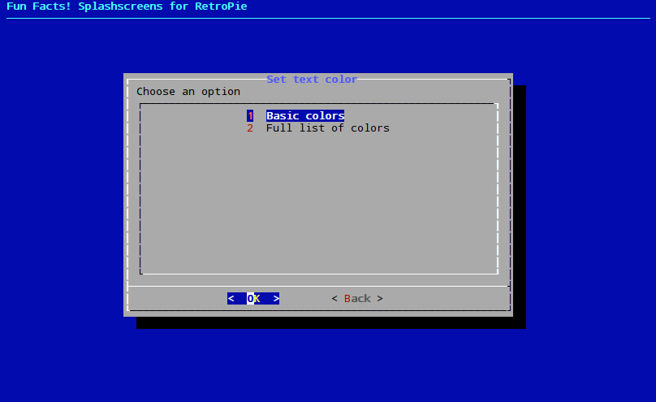
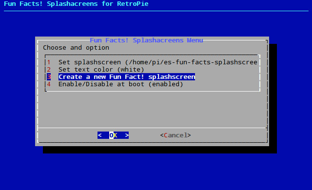
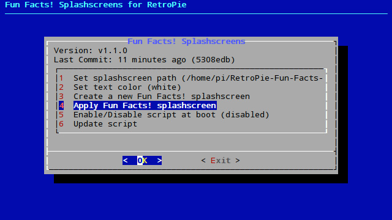
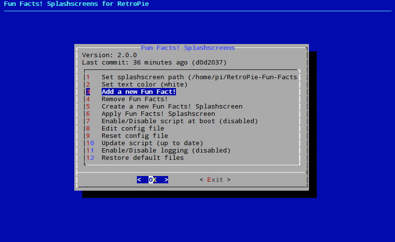
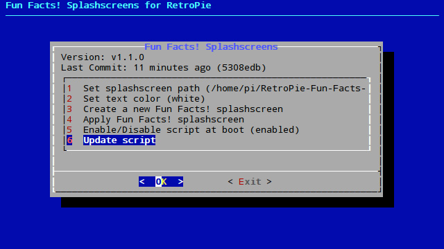

# Fun Facts! Splashscreens for RetroPie

A tool for RetroPie to generate splashscreens with random video game related fun facts.

**WARNING: Splashscreens are only available on the Raspberry Pi.**

## Installation

```
cd /home/pi/
git clone https://github.com/hiulit/RetroPie-Fun-Facts-Splashscreens.git
cd RetroPie-Fun-Facts-Splashscreens/
sudo chmod +x fun-facts-splashscreens.sh
```

You can also install **Fun Facts! Splashscreens** as a scriptmodule via the [RetroPie-Extra](https://github.com/zerojay/RetroPie-Extra) repository. Check the [supplementary](https://github.com/zerojay/RetroPie-Extra/#supplementary) section.

## Usage

```
sudo ./fun-facts-splashscreens.sh [OPTIONS]
```

If no options are passed, you will be prompted with a usage example:

```
USAGE: sudo ./fun-facts-splashscreens.sh [OPTIONS]

Use '--help' to see all the options.
```

## Options

* `--help`: Print the help message and exit.
* `--splash-path [OPTIONS]`: Set the image to use as Fun Facts! splashscreen.
* `--text-color [OPTIONS]`: Set the text color to use on the Fun Facts! splashscreen.
* `--add-fun-fact`: Add new **Fun Facts!**.
* `--remove-fun-fact`: Remove **Fun Facts!**.
* `--create-fun-fact`: Create a new **Fun Facts!** splashscreen.
* `--apply-splash`: Apply the **Fun Facts!** splashscreen.
* `--enable-boot`: Enable script at boot.
* `--disable-boot`: Disable script at boot.
* `--gui`: Start GUI.
* `--reset-config`: Reset config file.
* `--update`: Update script.
* `--version`: Show script version.
* `--enable-log`: Enable logging.
* `--disable-log`: Disable logging.

If `--splash-path` or `--text-color` are not set, the script takes the splashscreen and the text color defaults, `retropie-default.png` and `white`, respectively.

## Examples

### `--help`

Print the help message and exit.

#### Example

```
sudo ./fun-facts-splashscreens.sh --help
```

### `--splash-path [OPTIONS]`

Set the image to use as **Fun Facts! Splashscreen**.

#### Options

Must be an absolute path (e.g /home/pi/my-awesome-splashscreen.png).

* `path/to/splashscreen`: Path of the image to use as **Fun Facts! Splashscreen**.

#### Example

```
sudo ./fun-facts-splashscreens.sh --splash-path "/home/pi/my-awesome-splashscreen.png"
```

### `--text-color [OPTIONS]`

Set the text color to use on the **Fun Facts! Splashscreen**.

#### Options

* `color`: Text color of the **Fun Facts! Splashscreen**.

#### Example

```
sudo ./fun-facts-splashscreens.sh --text-color "black"
```

### `--create-fun-fact`

Create a new **Fun Facts! Splashscreen**.

The resulting splashscreen will be in `/home/pi/RetroPie/splashscreens/`.

#### Example

```
sudo ./fun-facts-splashscreens.sh --create-fun-fact
```

### `--apply-splash`

Apply the **Fun Facts! Splashscreen**.

This command must be run in order to use the **Fun Facts! Splashscreen**.

#### Example

```
sudo ./fun-facts-splashscreens.sh --apply-splash
```

### `--enable-boot`

Enable script at boot.

#### Example

```
sudo ./fun-facts-splashscreens.sh --enable-boot
```

### `--disable-boot`

Disable script at boot.

#### Example

```
sudo ./fun-facts-splashscreens.sh --disable-boot
```

### `--gui`

Start GUI.

It lets you perform all the functions, but in a more friendly manner.

#### Example

```
sudo ./fun-facts-splashscreens.sh --gui
```

##### Set splashscreen path (`--splash-path`)

##### Enter path to splashscreen

##### Set text color (`--text-color`)

##### Choose a color

##### Add new Fun Facts!

##### Remove Fun Facts!

##### Create a new Fun Facts! Splashscreen (`--create-fun-fact`)

##### Apply the Fun Facts! Splashscreen (`--apply-splash`)

##### Enable at boot (`--enable-boot`)

##### Disable at boot (`--disable-boot`)

##### Edit config file

##### Reset config file

##### Enable logging (`--enable-log`)

##### Disable logging (`--disable-log`)

##### Update script (`--update`)


### `--edit-config`

Edit config file.

Opens a simple file editor.

#### Example

```
sudo ./fun-facts-splashscreens.sh --edit-config
```

### `--reset-config`

Reset config file.

Removes all values from the config file. Next time the script is executed, it will populate the config file with defaults.

#### Example

```
sudo ./fun-facts-splashscreens.sh --reset-config
```

### `--update`

Update script.

#### Example

```
sudo ./fun-facts-splashscreens.sh --update
```

If you're using **Fun Facts! Splashscreens** via RetroPie-Setup (if you installed it as a scriptmodule via the [RetroPie-Extra](https://github.com/zerojay/RetroPie-Extra) repository), this function won't work. The scriptmodules have their own update function.

If that's the case, go to:

* Manage packages
* Manage experimental packages
* fun-facts-splashscreens
* Update from source

### `--version`

Show script version.

#### Example

```
sudo ./fun-facts-splashscreens.sh --version
```

### `--enable-log`

Enable logging.

The log file is `fun-facts-splashscreens.log`.

#### Example

```
sudo ./fun-facts-splashscreens.sh --enable-log
```

### `--disable-log`

Disable logging.

#### Example

```
sudo ./fun-facts-splashscreens.sh --disable-log
```

## Config file

When setting the splashscreen path using `--splash-path` or setting the text color using `--text-color`, whether it's done via the command line or the GUI, the generated values are stored in `fun-facts-splashscreens-settings.cfg`.

```
# Settings for Fun Facts Splashscreens.

# Set splashscreen path
#
# Must be an absolute path (e.g /home/pi/my-awesome-splashscreen.png).
splashscreen_path = ""

# Set splashscreen text color
#
# Short list of available colors:
#
# black, white, gray, gray10, gray25, gray50, gray75, gray90,
# pink, red, orange, yellow, green, silver, blue, cyan, purple, brown.
#
# TIP: run the 'convert -list color' command to get a full list.
text_color = ""

# Enable/disable script at boot
#
# Boolean: true/false.
boot_script = ""

# Enable/disable logging
#
# Boolean: true/false.
log = ""
```

You can edit this file directly instead of using `--splash-path` or `--text-color`.

## Add a new Fun Fact!

* Open `fun-facts.txt`.
* Add a new **Fun Fact!** (see [style guide](#style-guide)).

### Style guide

* Each **Fun Fact!** must be in one line.
* All video game names must be enclosed in double quotes (e.g. "Sonic the Hedgehog").
* Check the names using the [TheGamesDB](http://thegamesdb.net/) or any other reliable source.
* **Fun Facts!** aren't funnier even if they're written with exclamations marks. Don't use them.
* Tacky **Fun Facts!** aren't funnier either.
* Stick to **Fun Facts!** about video games that can be played with RetroPie (see [supported systems](https://github.com/retropie/retropie-setup/wiki/Supported-Systems)).
* Try not to make **Fun Facts!** too long.

If you have an awesome **Fun Fact!** that you'd like to share, you can create a [new issue]((/CONTRIBUTING.md)) with your awesome **Fun Fact!** and I'll gladly add it to the repository for everyone to enjoy! 😃🎉

Also (and preferably), if you know how, you can create a [pull request](/CONTRIBUTING.md) 😉

## Changelog

See [CHANGELOG](/CHANGELOG.md).

## Contributing

See [CONTRIBUTING](/CONTRIBUTING.md).

## Authors

Me 😛 [@hiulit](https://github.com/hiulit).

## Credits

Thanks to:

* [Parviglumis](https://retropie.org.uk/forum/user/parviglumis) - For the idea of creating the [Fun Facts! Splashscreens](https://retropie.org.uk/forum/topic/13630).
* [meleu](https://github.com/meleu/) - For all his help and wisdom with the code and for all the PRs! :D
* [zerojay](https://github.com/zerojay/) - For adding **Fun Facts! Splashscreens** to the [RetroPie-Extra](https://github.com/zerojay/RetroPie-Extra) repository.
* [Thunderforge](https://github.com/Thunderforge) - For adding more [**Fun Facts!**](https://github.com/hiulit/RetroPie-Fun-Facts-Splashscreens/pull/13).
* All the people at the [RetroPie Forum](https://retropie.org.uk/forum/).

## License

[MIT License](/LICENSE).
